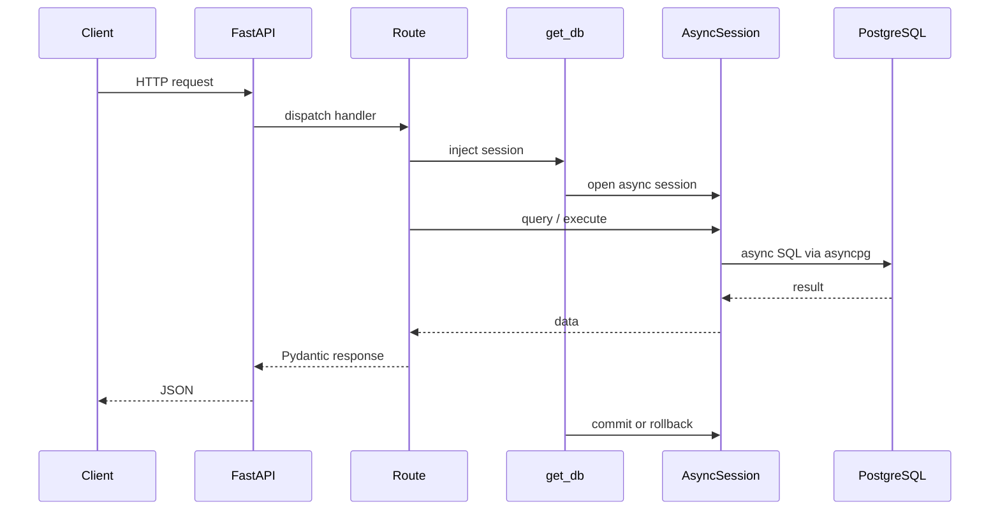
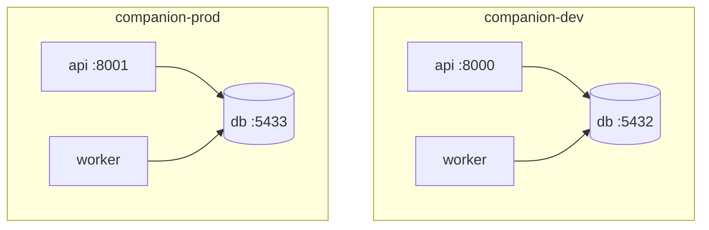
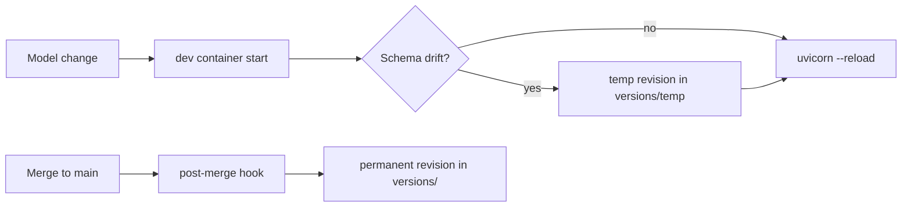
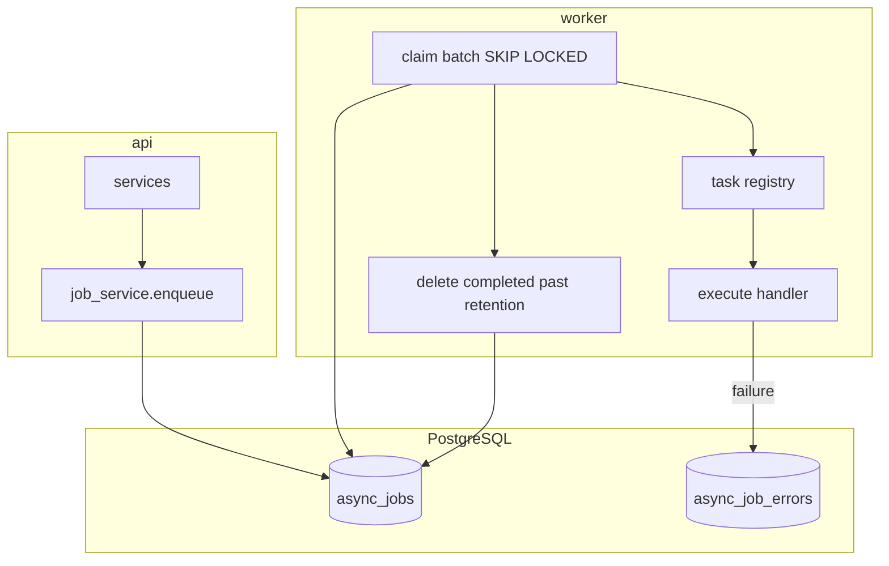
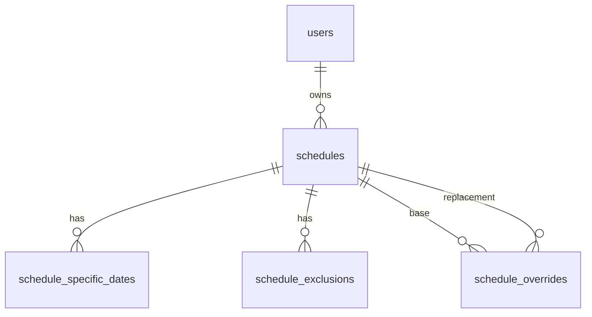
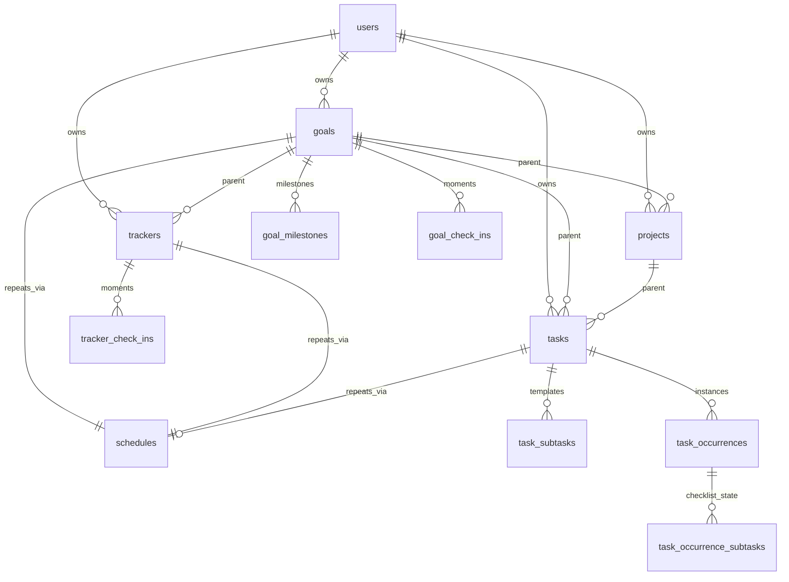
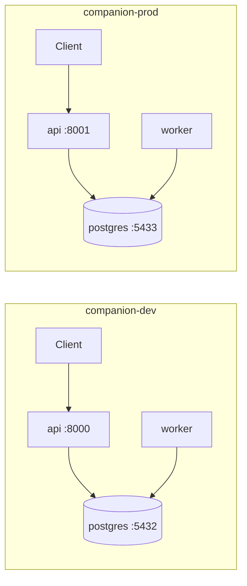
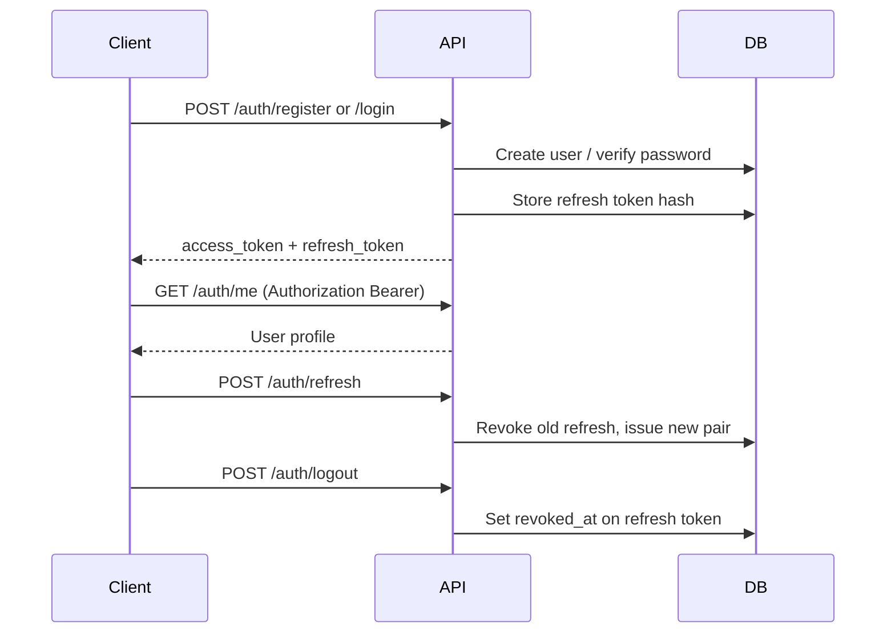

# Companion API — Architecture

## Overview

The Companion backend is the API layer of the Companion monorepo. It exposes HTTP endpoints for the frontend and other clients, persists data in PostgreSQL, and manages schema changes through Alembic migrations.

The stack is intentionally small and conventional: **FastAPI** for HTTP, **async SQLAlchemy 2.x** for database access at runtime, **Alembic** for schema migrations, and **PostgreSQL** as the primary datastore.

## Layered design

```
┌─────────────────────────────────────────┐
│  HTTP (FastAPI routes)                  │  app/api/routes/
├─────────────────────────────────────────┤
│  Schemas (Pydantic request/response)    │  app/schemas/
├─────────────────────────────────────────┤
│  Services (business logic, future)      │  app/services/  (not yet)
├─────────────────────────────────────────┤
│  Models (SQLAlchemy ORM)                │  app/models/
├─────────────────────────────────────────┤
│  Database (async engine + sessions)     │  app/database.py
└─────────────────────────────────────────┘
                    │
                    ▼
              PostgreSQL
```

New features should flow **downward**: define or extend models, add service functions if logic grows beyond a thin route, expose via schemas and routes.

## Request flow



Health endpoints illustrate two patterns:

- **`GET /health`** — no database; confirms the process is running.
- **`GET /health/db`** — uses `get_db` to run `SELECT 1`, confirming connectivity to PostgreSQL.

## Configuration

Settings live in `app/config.py` and load from environment variables (and optionally `.env` via `python-dotenv`).

| Variable | Purpose |
|----------|---------|
| `APP_ENV` | Environment name (`development`, `production`, …) |
| `DEBUG` | Enables SQL echo and verbose behavior when true |
| `DATABASE_URL` | Async connection string (`postgresql+asyncpg://…`) |
| `DATABASE_URL_SYNC` | Sync connection string for Alembic (`postgresql+psycopg2://…`) |
| `JWT_SECRET` | Secret for signing access tokens (required in production) |
| `JWT_ALGORITHM` | JWT algorithm (default `HS256`) |
| `ACCESS_TOKEN_EXPIRE_MINUTES` | Access token lifetime (default 15) |
| `REFRESH_TOKEN_EXPIRE_DAYS` | Refresh token lifetime (default 30) |
| `PASSWORD_MIN_LENGTH` | Minimum password length (default 8) |
| `CORS_ORIGINS` | Comma-separated allowed origins for CORS |
| `JOB_POLL_INTERVAL_SECONDS` | Worker sleep between poll iterations (default 5) |
| `JOB_BATCH_SIZE` | Max jobs claimed per iteration (default 10) |
| `JOB_MAX_RETRIES` | Default max retries per job (default 3) |
| `JOB_RETRY_BASE_SECONDS` | Linear backoff multiplier after failure (default 60) |
| `JOB_SUCCESS_RETENTION_SECONDS` | Delete completed jobs after this TTL (default 3600) |
| `JOB_LOCK_TIMEOUT_SECONDS` | Reclaim stale `running` jobs after this age (default 300) |

### Docker networking

Inside Docker Compose, the API service reaches PostgreSQL at hostname **`db`** (the service name). Connection strings in `.env.dev` / `.env.prod` use `db` as the host. When running the API on the host machine against a containerized database, use `localhost` and the published port (`5432` for dev, `5433` for prod).

## Local environments

Two Docker Compose stacks support parallel local development and production-like testing:

| Stack | Compose file | Project name | API port | DB port (host) |
|-------|--------------|--------------|----------|----------------|
| Dev | `docker-compose.dev.yml` | `companion-dev` | 8000 | 5432 |
| Prod (local) | `docker-compose.prod.yml` | `companion-prod` | 8001 | 5433 |



**Dev** — hot reload (`--reload`), source bind-mounts for `app/` and `alembic/`, `DEBUG=true`. Use for day-to-day feature work.

**Prod (local)** — no bind-mounts, multiple Uvicorn workers, `DEBUG=false`. Use to verify production-like behavior before deployment.

Each stack is fully isolated: separate Compose project, Docker network, and Postgres volume (`postgres_data_dev` vs `postgres_data_prod`). They can run simultaneously without port or data conflicts.

Start/stop via `make dev-up` / `make prod-up` or `scripts/dev.ps1` / `scripts/prod.ps1` on Windows.

## Async runtime vs sync migrations

| Concern | Driver | URL prefix | Used by |
|---------|--------|------------|---------|
| Application runtime | `asyncpg` | `postgresql+asyncpg://` | FastAPI, `app/database.py` |
| Migrations | `psycopg2` | `postgresql+psycopg2://` | Alembic CLI, `alembic/env.py` |

FastAPI is async-first; blocking the event loop on database I/O would hurt throughput. **Async SQLAlchemy** with `asyncpg` keeps request handlers non-blocking.

Alembic’s CLI and migration scripts are traditionally **synchronous**. Using a sync engine and `psycopg2` for migrations avoids extra async boilerplate in `env.py` while sharing the same PostgreSQL database and schema as the app.

Both URLs point at the same database; only the driver differs.

## Migrations workflow

### Permanent vs temporary revisions

| Type | Location | Git | When created |
|------|----------|-----|--------------|
| Permanent | `alembic/versions/*.py` | Committed | After merge to `main`/`develop` (squash) |
| Temporary | `alembic/versions/temp/*.py` | Gitignored (local only) | Dev container startup when models drift |



### Day-to-day (feature branch)

1. **Change models** — add or edit SQLAlchemy models under `app/models/` and import them in `app/models/__init__.py`.
2. **Restart dev** — `make dev-up` (or recreate the API container). The entrypoint runs `scripts/migration_autogen.py`, which applies migrations and creates a temp revision if needed.
3. **Iterate** — each model change on restart adds another local temp revision (linear chain under `temp_` prefix).

### Merge (main / develop)

1. **Install hooks** — `make install-hooks` or `.\backend\scripts\install-git-hooks.ps1` from repo root (one-time).
2. **Merge branch** — post-merge hook runs `scripts/squash_migrations.py`:
   - Downgrades dev DB to the last permanent head
   - Deletes `alembic/versions/temp/*`
   - Autogenerates one permanent revision from model diff
   - Names it `NNN_<branchSlug>.py` (next 3-digit id + slug from merged branch, e.g. `003_security.py`)
   - Upgrades to head
3. **Review and commit** the new file in `alembic/versions/`.

Slug resolution order: CLI `-m` flag → merged branch name (`HEAD^2`) → parsed merge commit subject → `schema_update`.

Manual squash: `make squash-migrations` or `python scripts/squash_migrations.py -m feature_name` (dev DB must be reachable on `localhost:5432`).

Squash only replaces **`temp_*`** revisions. Multiple committed permanent files on a branch must be consolidated manually (delete old files, downgrade DB, run squash).

### Production

Run `make prod-migrate` — applies only **committed** permanent revisions. No autogenerate on prod startup.

The initial revision (`001_initial`) is an empty baseline so `alembic_version` is tracked from the first deploy.

## Application lifecycle

`app/main.py` registers a **lifespan** context manager that disposes the async engine on shutdown, closing pooled connections cleanly.

## Extension points

| Need | Where to add |
|------|----------------|
| New endpoint | `app/api/routes/<resource>.py`, include router in `main.py` |
| Request/response types | `app/schemas/` |
| Tables / relationships | `app/models/`, then autogenerate migration |
| Shared DB access in routes | `Depends(get_db)` from `app/dependencies.py` |
| Cross-route business logic | `app/services/` (recommended as the app grows) |
| Background work | `job_service.enqueue()` + task in `app/jobs/tasks/` |
| Auth / middleware | FastAPI middleware or dependencies in `app/dependencies.py` |

## Async jobs

Background work uses a **PostgreSQL-backed job queue** and a dedicated **worker** process (not in-process FastAPI background tasks). This avoids duplicate polling when the API runs multiple Uvicorn workers.



### Tables

- **`async_jobs`** — `task_name`, JSON `parameters`, `status` (`pending` / `running` / `completed` / `failed`), retry counters, scheduling and lock metadata.
- **`async_job_errors`** — one row per failed attempt (`message`, optional `detail` traceback).

### Lifecycle

1. **Enqueue** — `job_service.enqueue(session, task_name, parameters)` inserts a `pending` row with `scheduled_at = now()`.
2. **Claim** — worker selects eligible `pending` rows (`scheduled_at <= now`, `retry_count < max_retries`) with `FOR UPDATE SKIP LOCKED`, marks them `running`.
3. **Execute** — handler from `@register_task("name")` in `app/jobs/tasks/` runs with the job parameters and a DB session.
4. **Success** — status `completed`; row deleted after `JOB_SUCCESS_RETENTION_SECONDS`.
5. **Failure** — append `async_job_errors`, increment `retry_count`, reschedule with linear backoff (`retry_count * JOB_RETRY_BASE_SECONDS`) or mark `failed` when max retries exceeded.
6. **Stale locks** — `running` jobs older than `JOB_LOCK_TIMEOUT_SECONDS` are reset to `pending` (crashed worker recovery).
7. **Unknown task** — permanent `failed` (no retry loop).

There is no public REST API for jobs in v1; enqueue from services only.

### Adding a task

1. Create `app/jobs/tasks/my_task.py` with `@register_task("my_task")`.
2. Import the module in `app/jobs/tasks/__init__.py`.
3. Call `await job_service.enqueue(session, "my_task", {...})` from a service or route.

The bundled **`example`** task is a no-op for wiring checks.

## Scheduling

Reusable recurrence rules for productivity features (tasks, reminders, alarms). Schedules are **user-owned** standalone entities; future domain models will reference them via `schedule_id`.



### Repeat types

| Type | Meaning |
|------|---------|
| `none` | Single occurrence at `anchor_at` |
| `weekdays` | Selected ISO weekdays (1=Mon…7=Sun), every `interval` weeks |
| `every_n_days` | Every `interval` days from anchor |
| `every_n_weeks` | Every `interval` weeks from anchor |
| `every_n_months` | Same day-of-month as anchor, every `interval` months |
| `every_n_years` | Same month/day as anchor, every `interval` years |
| `specific_dates` | Explicit calendar dates (time from anchor’s local time-of-day) |
| `month_days` | Selected days of month (1–31), every `interval` months |

Each schedule stores `anchor_at` (timestamptz), optional `start_date` / `end_date` (timestamptz window), and `timezone` (IANA). On task forms, **start date** drives `anchor_at` (fallback: task deadline, then planned date). Goals/trackers still set `anchor_at` via their schedule start field. **Overrides** swap in another schedule: `from_date` (all occurrences from `effective_at` onward) or `single_occurrence` (one instant).

### Expansion pipeline

1. Load schedule bundle (rules, exclusions, overrides with replacement schedules).
2. Split timeline at `from_date` override boundaries; expand each segment with the active rule set.
3. Apply `single_occurrence` overrides (replacement `none` uses replacement `anchor_at`).
4. Filter exclusion dates in schedule timezone.
5. Return sorted UTC datetimes (preview API and future consumers).

Pure logic lives in `app/scheduling/` (`expander.py`, `validators.py`) — no database dependency, covered by unit tests.

### API

All routes require authentication (`get_current_active_user`).

| Method | Path | Purpose |
|--------|------|---------|
| `POST` | `/api/v1/schedules` | Create schedule |
| `GET` | `/api/v1/schedules` | List (paginated) |
| `GET` | `/api/v1/schedules/{id}` | Get with dates, exclusions, overrides |
| `PATCH` | `/api/v1/schedules/{id}` | Update rule fields |
| `DELETE` | `/api/v1/schedules/{id}` | Delete (cascades children) |
| `POST` | `/api/v1/schedules/{id}/preview` | Expand occurrences in window |
| `PUT` | `/api/v1/schedules/{id}/specific-dates` | Replace date list |
| `PUT` | `/api/v1/schedules/{id}/exclusions` | Replace exclusion list |
| `POST` | `/api/v1/schedules/{id}/overrides` | Add override |
| `DELETE` | `/api/v1/schedules/{id}/overrides/{override_id}` | Remove override |

Replacement schedules must belong to the same user and cannot define their own overrides (v1).

## Productivity entities

User-owned **goals**, **projects**, **tasks**, and **trackers** for the productivity module.



### Fields

| Entity | Required | Optional |
|--------|----------|----------|
| Goal | `name`, `schedule_id` or inline `schedule`, `start_date`, `goal_type`, `target`, `unit`, `direction` | `description`, `icon`, `color`, `end_date`, `milestones` (inline create) |
| Tracker | `name`, `schedule_id` or inline `schedule`, `start_date`, `check_in_type`, `habit_direction` | `description`, `icon`, `color`, `end_date`, `target`, `unit`, `goal_id` |
| Project | `name` | `start_date`, `deadline`, `description`, `icon`, `color`, `goal_id`, `status` |

**Project `status`:** `planning`, `active`, `on_hold`, `completed`, `cancelled` (default `planning`).
| Task | `name` | `planned_at`, `deadline`, `description`, `project_id`, `goal_id`, `schedule_id`, `schedule` (inline create), `status`, `priority`, `subtasks` |

**Task `status`:** `pending`, `in_progress`, `completed`, `cancelled` (default `pending`).

**Task `priority`:** `low`, `medium`, `high`, `urgent` (default `medium`).

**Tracker `check_in_type`:** `task`, `count`, `duration`.

- **task:** no `target` or `unit`; check-ins log `completed` (boolean).
- **count:** requires `target` and `unit`; check-ins log `count_value`.
- **duration:** requires `target` (seconds); check-ins log `value_seconds`.

**Tracker `habit_direction`:** `build`, `quit` (forming vs breaking the habit).

**Goal `goal_type`:** `count`, `task`, `pulse`.

- **count:** check-ins log cumulative `count_value` toward the goal `target`.
- **task:** check-ins log `completed` (progress this period).
- **pulse:** `pulse_score` (1–10) is system-generated later; user PATCH not supported in v1.

**Goal `direction`:** `increasing`, `decreasing`.

**Goal milestones** (`goal_milestones`): `value` (numeric threshold) and optional `name`; managed via nested milestone endpoints or inline on create.

### Repeating goals and check-ins

- **Schedule:** required `schedule_id` or inline `schedule` (mutually exclusive); must be recurring for `fixed_schedule` mode.
- **Quota mode:** same semantics as trackers (`check_in_mode`, quota fields, floating slots, period miss marker).
- **Window:** `start_date` required; optional `end_date`. Check-in expansion clipped to this window.
- **Check-ins** (`goal_check_ins`): materialized lazily via `GET /goals/{id}/check-ins?from=&to=`; log task/count progress with `PATCH`.

### Repeating trackers and check-ins

- **Schedule:** required `schedule_id` or inline `schedule` (mutually exclusive); must be recurring (`repeat_type` ≠ `none`) for `fixed_schedule` mode.
- **Quota mode (`times_per_period`):** optional `check_in_mode=times_per_period` with `quota_times`, `quota_period_interval`, and `quota_period_unit` (`weeks`, `months`, `years`). Calendar-aligned periods spawn floating active slots that lock on log; one `period_miss` marker remains on the last day when the quota is not met. Skip is not available in quota mode.
- **Window:** `start_date` required; optional `end_date` (null = open-ended). Occurrence expansion is clipped to this window.
- **Check-ins** (`tracker_check_ins`): materialized lazily via `GET /trackers/{id}/check-ins?from=&to=` using the scheduling expander (fixed schedule) or quota materializer (times per period); log progress with `PATCH`.

### Repeating tasks and subtasks

- **Schedule:** optional `schedule_id` or inline `schedule` payload (mutually exclusive) on create/update. Inline/existing schedules may include optional `start_date` / `end_date` to clip occurrence expansion.
- **Non-repeating** (`schedule_id` null or schedule `none`): one `task_occurrence` at create; task-level `status`/`priority` sync to that row.
- **Repeating:** occurrences materialized lazily via `GET /tasks/{id}/occurrences?from=&to=` using the scheduling expander, clipped to the schedule's optional `start_date` / `end_date` window when set. Pass `existing_only=true` to read persisted rows only (no materialization) — used by the task list UI for virtual rows until first edit. `POST /tasks/{id}/occurrences` with `{ occurrence_at }` get-or-creates one instance on first interaction.
- **Subtask templates** (`task_subtasks`): checklist titles on the task; **completion** is stored per occurrence in `task_occurrence_subtasks` so checking off on one date does not affect other instances.

### Parent rules

- **Task**: at most one parent — optional `project_id` **or** optional `goal_id` (never both; enforced in DB and Pydantic).
- **Project**: optional `goal_id` parent.
- **Tracker**: optional `goal_id` parent.
- **Goal**: no parent.

Parent FKs must belong to the same user. Deleting a goal or project **sets null** on child FKs (`ON DELETE SET NULL`), not cascade-delete children.

### API

Authenticated CRUD under `/api/v1/goals`, `/projects`, `/tasks`, `/trackers` (list responses: `{ items, total, limit, offset }`).

**Task extensions:**

| Method | Path | Purpose |
|--------|------|---------|
| `GET` | `/tasks/{id}/occurrences` | Materialize and list occurrences with subtask states (`existing_only=true` skips materialization) |
| `POST` | `/tasks/{id}/occurrences` | Get-or-create one occurrence at `occurrence_at` |
| `PATCH` | `/tasks/{id}/occurrences/{occurrence_id}` | Update status/priority for one instance |
| `PUT` | `/tasks/{id}/subtasks` | Replace subtask templates |
| `PATCH` | `/tasks/{id}/occurrences/{occurrence_id}/subtasks/{subtask_id}` | Toggle `completed` for one instance |

**Goal extensions:**

| Method | Path | Purpose |
|--------|------|---------|
| `GET` | `/goals/{id}/check-ins` | Materialize and list check-in moments |
| `PATCH` | `/goals/{id}/check-ins/{check_in_id}` | Log task/count progress |
| `GET` | `/goals/{id}/milestones` | List milestones |
| `PUT` | `/goals/{id}/milestones` | Replace all milestones |
| `POST` | `/goals/{id}/milestones` | Add one milestone |
| `PATCH` | `/goals/{id}/milestones/{milestone_id}` | Update milestone |
| `DELETE` | `/goals/{id}/milestones/{milestone_id}` | Remove milestone |

**Tracker extensions:**

| Method | Path | Purpose |
|--------|------|---------|
| `GET` | `/trackers/{id}/check-ins` | Materialize and list check-in moments |
| `PATCH` | `/trackers/{id}/check-ins/{check_in_id}` | Log progress for one moment |

## Infrastructure (local)

Each environment runs API, worker, and database containers:



- **`api`** — builds from `Dockerfile`, runs Uvicorn (reload in dev, workers in prod).
- **`worker`** — same image; entrypoint runs `alembic upgrade head`, then `python scripts/run_worker.py`. Polls `async_jobs` after schema is ready.
- **`db`** — `postgres:16-alpine` with a per-environment named volume.
- **`api`** and **`worker`** both wait for **`db`** healthcheck; each applies migrations on startup (dev API also autogenerates temp revisions when models drift).

Production deployments will likely mirror this split (stateless API service + managed PostgreSQL) with environment-specific secrets and networking.

## Security

### Authentication

Auth endpoints live under `/api/v1/auth`. The API uses **JWT access tokens** (short-lived) and **opaque refresh tokens** (stored hashed in PostgreSQL, revocable on logout).



| Endpoint | Auth | Purpose |
|----------|------|---------|
| `POST /api/v1/auth/register` | Public | Create account |
| `POST /api/v1/auth/login` | Public | Obtain tokens |
| `POST /api/v1/auth/refresh` | Public | Rotate refresh token |
| `POST /api/v1/auth/logout` | Bearer | Revoke refresh token(s) |
| `GET /api/v1/auth/me` | Bearer | Auth check + profile |

Passwords are hashed with **Argon2id** (argon2-cffi). Login errors are generic (`Invalid email or password`) to avoid account enumeration.

`get_current_user` and `get_current_active_user` in `app/dependencies.py` protect E2E and other private routes.

### End-to-end encryption (server role)

The server **never stores plaintext message content or private keys**. Clients encrypt locally; the API relays **public key bundles** and **ciphertext blobs**.

| Endpoint | Purpose |
|----------|---------|
| `POST /api/v1/devices` | Register device + upload identity/signed/one-time prekeys |
| `GET /api/v1/users/{user_id}/keys` | Fetch recipient public key bundle (consumes one one-time prekey) |
| `POST /api/v1/keys/prekeys` | Upload additional one-time prekeys |
| `POST /api/v1/messages` | Store encrypted payload for a recipient |
| `GET /api/v1/messages` | Fetch undelivered inbox (marks delivered on read) |

Public keys and ciphertext must be **base64** with size limits (`MAX_PUBLIC_KEY_BYTES`, `MAX_CIPHERTEXT_BYTES` in config). Future clients should implement the cryptographic protocol (e.g. Double Ratchet); the backend only provides storage and discovery.

### Hardening

- **CORS** — configurable via `CORS_ORIGINS`
- **Rate limiting** — auth register/login limited (slowapi)
- **Security headers** — `X-Content-Type-Options`, `X-Frame-Options`, `Referrer-Policy`
- **OpenAPI docs** — disabled when `APP_ENV=production`

Health checks remain at `/health` (no auth) for load balancers.

### API testing

Import [`companion-api.postman_collection.json`](companion-api.postman_collection.json) and optionally [`companion-api.postman_environment.json`](companion-api.postman_environment.json) into Postman. Register/Login requests auto-save `accessToken` and `refreshToken` to collection variables.
