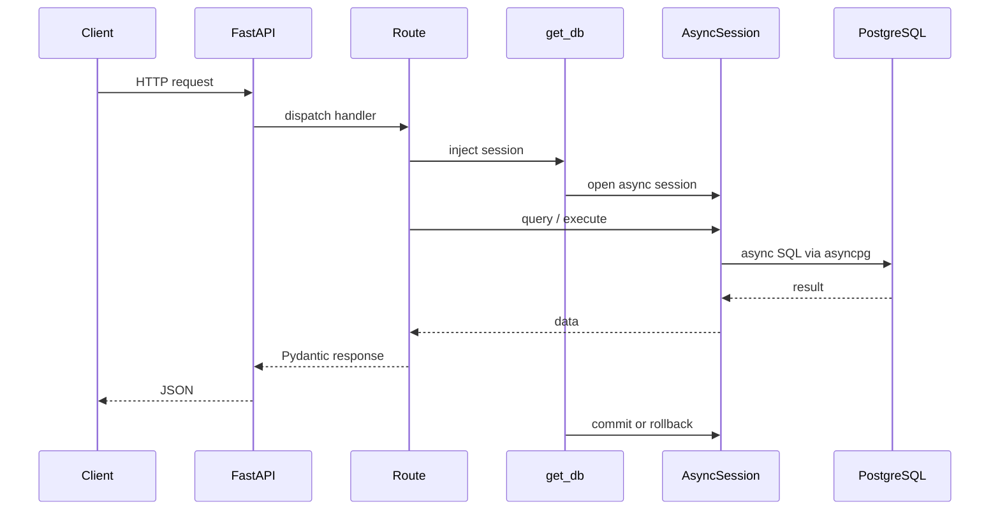
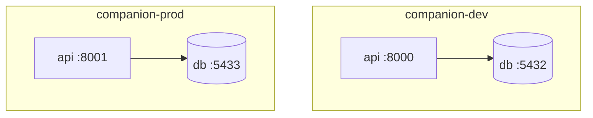
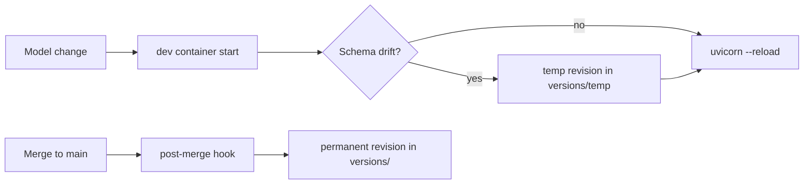
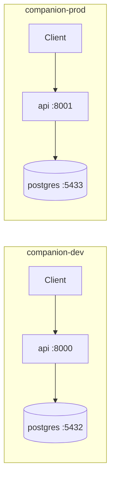

# Companion API — Architecture

## Overview

The Companion backend is the API layer of the Companion monorepo. It exposes HTTP endpoints for the frontend and other clients, persists data in PostgreSQL, and manages schema changes through Alembic migrations.

The stack is intentionally small and conventional: **FastAPI** for HTTP, **async SQLAlchemy 2.x** for database access at runtime, **Alembic** for schema migrations, and **PostgreSQL** as the primary datastore.

## Layered design

```
┌─────────────────────────────────────────┐
│  HTTP (FastAPI routes)                  │  app/api/routes/
├─────────────────────────────────────────┤
│  Schemas (Pydantic request/response)    │  app/schemas/
├─────────────────────────────────────────┤
│  Services (business logic, future)      │  app/services/  (not yet)
├─────────────────────────────────────────┤
│  Models (SQLAlchemy ORM)                │  app/models/
├─────────────────────────────────────────┤
│  Database (async engine + sessions)     │  app/database.py
└─────────────────────────────────────────┘
                    │
                    ▼
              PostgreSQL
```

New features should flow **downward**: define or extend models, add service functions if logic grows beyond a thin route, expose via schemas and routes.

## Request flow



Health endpoints illustrate two patterns:

- **`GET /health`** — no database; confirms the process is running.
- **`GET /health/db`** — uses `get_db` to run `SELECT 1`, confirming connectivity to PostgreSQL.

## Configuration

Settings live in `app/config.py` and load from environment variables (and optionally `.env` via `python-dotenv`).

| Variable | Purpose |
|----------|---------|
| `APP_ENV` | Environment name (`development`, `production`, …) |
| `DEBUG` | Enables SQL echo and verbose behavior when true |
| `DATABASE_URL` | Async connection string (`postgresql+asyncpg://…`) |
| `DATABASE_URL_SYNC` | Sync connection string for Alembic (`postgresql+psycopg2://…`) |

### Docker networking

Inside Docker Compose, the API service reaches PostgreSQL at hostname **`db`** (the service name). Connection strings in `.env.dev` / `.env.prod` use `db` as the host. When running the API on the host machine against a containerized database, use `localhost` and the published port (`5432` for dev, `5433` for prod).

## Local environments

Two Docker Compose stacks support parallel local development and production-like testing:

| Stack | Compose file | Project name | API port | DB port (host) |
|-------|--------------|--------------|----------|----------------|
| Dev | `docker-compose.dev.yml` | `companion-dev` | 8000 | 5432 |
| Prod (local) | `docker-compose.prod.yml` | `companion-prod` | 8001 | 5433 |



**Dev** — hot reload (`--reload`), source bind-mounts for `app/` and `alembic/`, `DEBUG=true`. Use for day-to-day feature work.

**Prod (local)** — no bind-mounts, multiple Uvicorn workers, `DEBUG=false`. Use to verify production-like behavior before deployment.

Each stack is fully isolated: separate Compose project, Docker network, and Postgres volume (`postgres_data_dev` vs `postgres_data_prod`). They can run simultaneously without port or data conflicts.

Start/stop via `make dev-up` / `make prod-up` or `scripts/dev.ps1` / `scripts/prod.ps1` on Windows.

## Async runtime vs sync migrations

| Concern | Driver | URL prefix | Used by |
|---------|--------|------------|---------|
| Application runtime | `asyncpg` | `postgresql+asyncpg://` | FastAPI, `app/database.py` |
| Migrations | `psycopg2` | `postgresql+psycopg2://` | Alembic CLI, `alembic/env.py` |

FastAPI is async-first; blocking the event loop on database I/O would hurt throughput. **Async SQLAlchemy** with `asyncpg` keeps request handlers non-blocking.

Alembic’s CLI and migration scripts are traditionally **synchronous**. Using a sync engine and `psycopg2` for migrations avoids extra async boilerplate in `env.py` while sharing the same PostgreSQL database and schema as the app.

Both URLs point at the same database; only the driver differs.

## Migrations workflow

### Permanent vs temporary revisions

| Type | Location | Git | When created |
|------|----------|-----|--------------|
| Permanent | `alembic/versions/*.py` | Committed | After merge to `main`/`develop` (squash) |
| Temporary | `alembic/versions/temp/*.py` | Gitignored (local only) | Dev container startup when models drift |



### Day-to-day (feature branch)

1. **Change models** — add or edit SQLAlchemy models under `app/models/` and import them in `app/models/__init__.py`.
2. **Restart dev** — `make dev-up` (or recreate the API container). The entrypoint runs `scripts/migration_autogen.py`, which applies migrations and creates a temp revision if needed.
3. **Iterate** — each model change on restart adds another local temp revision (linear chain under `temp_` prefix).

### Merge (main / develop)

1. **Install hooks** — `make install-hooks` (one-time).
2. **Merge branch** — post-merge hook runs `scripts/squash_migrations.py`:
   - Downgrades dev DB to the last permanent head
   - Deletes `alembic/versions/temp/*`
   - Autogenerates one permanent revision from model diff
   - Upgrades to head
3. **Review and commit** the new file in `alembic/versions/`.

Manual squash: `make squash-migrations` (dev DB must be reachable on `localhost:5432`).

### Production

Run `make prod-migrate` — applies only **committed** permanent revisions. No autogenerate on prod startup.

The initial revision (`001_initial`) is an empty baseline so `alembic_version` is tracked from the first deploy.

## Application lifecycle

`app/main.py` registers a **lifespan** context manager that disposes the async engine on shutdown, closing pooled connections cleanly.

## Extension points

| Need | Where to add |
|------|----------------|
| New endpoint | `app/api/routes/<resource>.py`, include router in `main.py` |
| Request/response types | `app/schemas/` |
| Tables / relationships | `app/models/`, then autogenerate migration |
| Shared DB access in routes | `Depends(get_db)` from `app/dependencies.py` |
| Cross-route business logic | `app/services/` (recommended as the app grows) |
| Auth / middleware | FastAPI middleware or dependencies in `app/dependencies.py` |

## Infrastructure (local)

Each environment runs an independent pair of containers:



- **`api`** — builds from `Dockerfile`, runs Uvicorn (reload in dev, workers in prod).
- **`db`** — `postgres:16-alpine` with a per-environment named volume.
- **`api`** waits for **`db`** healthcheck before starting.

Production deployments will likely mirror this split (stateless API service + managed PostgreSQL) with environment-specific secrets and networking.
